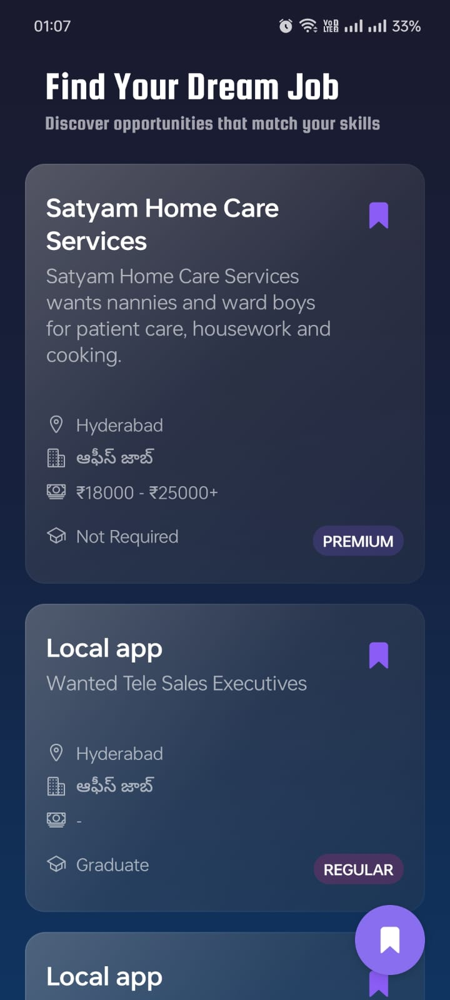
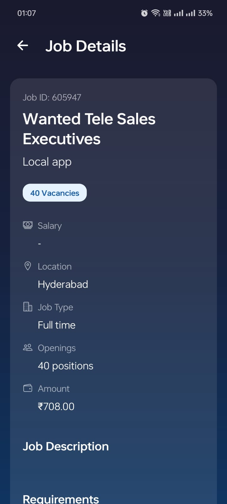
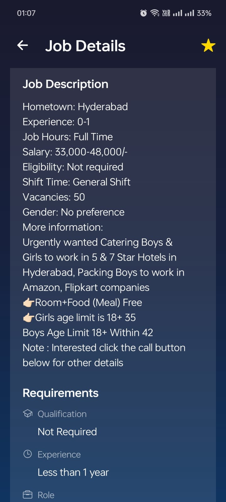
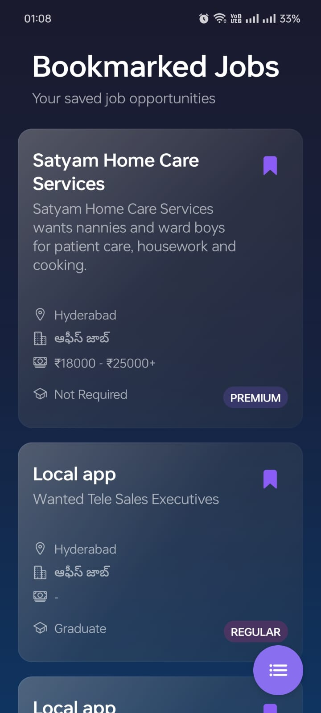
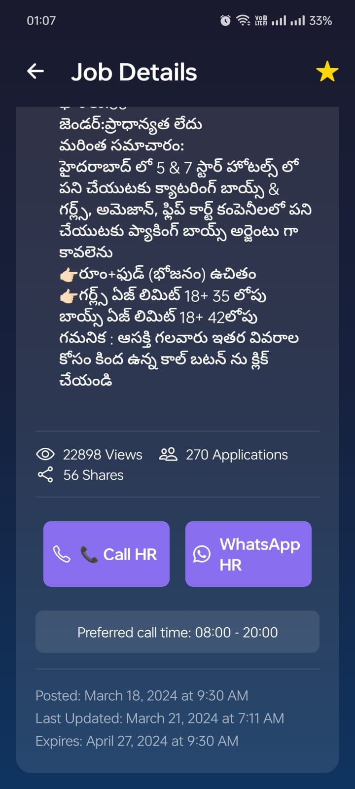
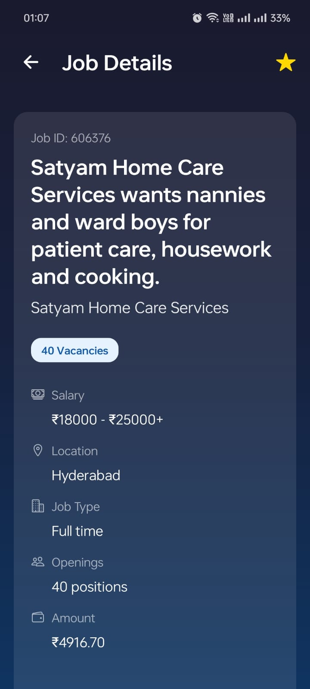

# Job Listing Mobile App
I created a React Native app completely using JavaScript for a React Native Intern Assignment for Lokal.
This is not to be used for Personal projects or commercial use outside of this specific context.
A modern React Native mobile application for browsing and bookmarking job listings. Built with Expo and featuring a sleek, dark-themed UI with smooth animations.

## Features

- 📱 Modern, responsive UI with dark theme
- 🔍 Browse job listings with detailed information
- 🔖 Bookmark favorite jobs for quick access
- 💫 Smooth animations and transitions
- 🌈 Beautiful gradient backgrounds and blur effects
- 📊 Premium job filtering
- 🔄 Real-time bookmark synchronization

## Screenshots
(demo.mp4)
### Job Listings and Details

*Main screen showing job listings with premium/regular indicators and bookmark functionality*


*Detailed job information with company details and requirements*


*Extended job information showing salary, location, and contact options*

### Bookmarks and Navigation

*Bookmarked jobs screen showing saved opportunities*

### Additional Details

*Job posting details with application statistics and contact options*


*Comprehensive job information with qualification requirements*

### Key Features Shown:
- Dark theme with purple accents (#8B5CF6)
- Gradient cards with blur effects
- Premium/Regular job indicators
- Bookmark functionality
- Detailed job information
- Multilingual support (Telugu language)
- Call/WhatsApp HR direct contact options
- Job statistics (views, applications, shares)
- Posting dates and expiration information

## Tech Stack

- React Native
- Expo
- Expo Router for navigation
- AsyncStorage for local data persistence
- Expo Linear Gradient for UI effects
- Expo Blur for modern UI elements
- Ionicons for iconography

## Prerequisites

- Node.js (v14 or higher)
- npm or yarn
- Expo CLI
- iOS Simulator (for Mac) or Android Emulator

## Installation

1. Clone the repository:
```bash
git clone [repository-url]
cd api_app
```

2. Install dependencies:
```bash
npm install
# or
yarn install
```

3. Start the development server:
```bash
npm start
# or
yarn start
```

4. Run on your preferred platform:
- Press `i` for iOS simulator
- Press `a` for Android emulator
- Scan QR code with Expo Go app for physical device

## Project Structure

```
api_app/
├── app/
│   ├── _layout.js        # Main navigation layout
│   ├── index.js          # Jobs screen
│   └── bookmarks.js      # Bookmarks screen
├── components/
│   ├── JobListingScreen.js
│   └── BookmarksScreen.js
├── App.js                # Root component
└── package.json
```

## Features in Detail

### Job Listing Screen
- Displays available job opportunities
- Shows company name, job title, and key details
- Premium job indicators
- Interactive bookmark functionality
- Smooth press animations

### Bookmarks Screen
- Lists all bookmarked jobs
- Real-time updates when bookmarks change
- Persistent storage using AsyncStorage
- Empty state handling

### UI/UX Features
- Dark theme with purple accent color (#8B5CF6)
- Gradient backgrounds
- Blur effects for depth
- Smooth animations for interactions
- Bottom tab navigation
- Custom tab bar indicator

## API Integration

The app integrates with a job listing API:
- Base URL: `https://testapi.getlokalapp.com`
- Endpoint: `/common/jobs`
- Supports pagination
- Filters jobs by type

## Contributing

1. Fork the repository
2. Create your feature branch (`git checkout -b feature/AmazingFeature`)
3. Commit your changes (`git commit -m 'Add some AmazingFeature'`)
4. Push to the branch (`git push origin feature/AmazingFeature`)
5. Open a Pull Request

## License

This project is licensed under the MIT License - see the LICENSE file for details.

## Acknowledgments

- Expo team for the amazing framework
- React Native community
- Ionicons for the beautiful icon set 
